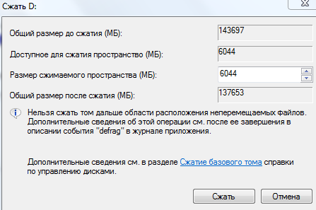

# Как поставить Linux второй системой?
## Кому может быть полезен?
`
Гайд может быть полезен не только тем, у кого стоит Windows основной системойб но и в целом пользователям, намеренным поменять сменить систему.
`
## Примечание 
`В гайде речь будет идти об устарновке linux(Ubuntu 24-04.2) совместно с Windows 11`

## Подготовка загрузочного USB-накопителя
1. Первое, что предстоит сделать подготовить хранилище, на которое будет установлен образ Ubuntu 24-04.02\
Образ системы (ISO-образ) — это файл, содержащий точную копию содержимого диска (например, установочного DVD). Он включает в себя всё необходимое для загрузки компьютера или установки операционной системы\
[Ссылка на установку образа Ubuntu 24-04.02](https://discourse.ubuntu.com/t/ubuntu-installation-on-computers-running-windows-and-bitlocker-turned-on/15338)
2. iso-образ сам по себе не может быть запущен. Разве что он может пригодиться при настройках виртуальной машины. При установке новой системы необходимо создать загрузочный USB-накопитель. Для этого нам понадобиться установить Rufus\
[Ссылка на скачивание Rufus](https://rufus.ie/ru/#google_vignette)
3. Rufus

## Выделение в памяти устройства пространства под новую систему
Логически пространство памяти на компьютерах и ноутбуках разделено на тома(разделы).\
Для новой системы понадобиться создать новый том, в котором она будет храниться. До этого необходимо выполнить сжатие тома, который мы будем делить.
```
Сжать том — это уменьшить его размер, при этом хранящиеся в сжимаемом разделе данные, не обрабатываются, а лишь перемещаются.
```
4. Откройте "Управление дисками" на своем устройстве.\
 I способ. Win+R -> diskmgmt.msc -> enter \
II способ. В Windows Search: создание и форматирование разделов жесткого диска.
5. Выберете диск, на который впоследствии произведется установка Ubuntu 24-04.2. Нажмите на него правой конпкой мыши и выбирете сжать том. 
 
 
 В ячейке "Размер желаемого пространства" укажите, количество Мб, выделяемое для системы. Я решил выделить 100 Гб для системы, т.е. 102400 Мб. Запишу 102400 в соответсвующей ячейке.
## Настройка BIOS - Basic Input/Output System
`Установка системы воспроизводиться на ASUS TUF GAMING F15`
На этом этапе инструкция будет зависеть от материнской платы вашего ПК/ноутбука и производителя, поэтому далее будет вестись описание с точностью до нажимаемых клавишь. \

6. Убедитесь, что загрузочный USB-накопитель подключен к устройству и выключите устройство.\
7. При включении необхожимо зайти в BIOS. Для этого воспользуйтесь одним из нижеуказанных способов (подойдет только один; зависит от устройства)\
    * Для ноутбуков: Запустите устройство, зажав `f2` (`f1`/`f3`/`f10`)
    * Для ПК:        Запустите устройство, зажав `Delete`
8. В boot options:\
    8. 1. Отключить secure Boot (выставить disabled)\
    8. 2. В Boot Order загрузочную флешку поставь на первое место.
9. "Try or install Ubuntu"
10. Запуститься Live-режим Ubuntu (Ubuntu с флешки, еще не то, что мы пытаемся достичь)