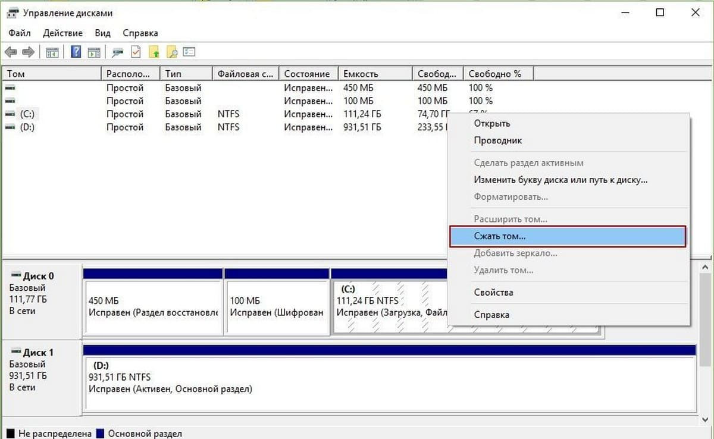
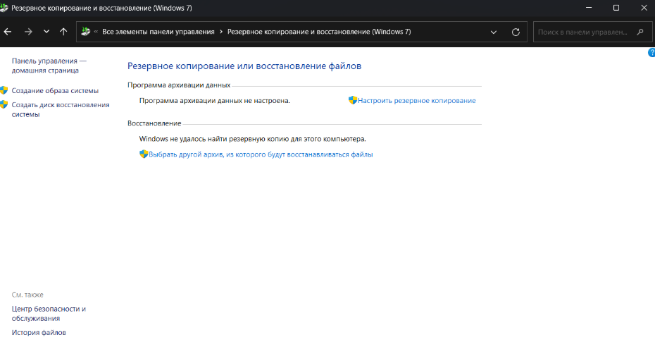
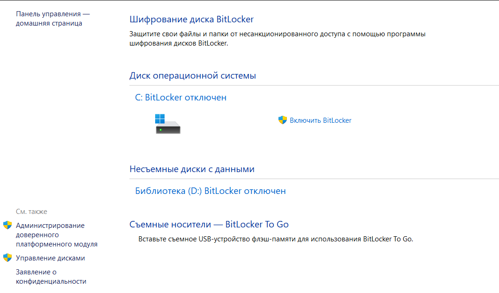
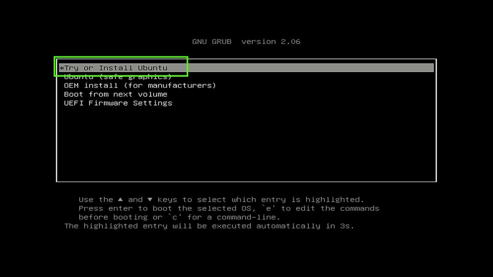

# Как поставить Linux второй системой?
## Кому может быть полезен?
`
Гайд может быть полезен не только тем, у кого стоит Windows основной системойб но и в целом пользователям, намеренным поменять сменить систему.
`
## Примечание 
`В гайде речь будет идти об устарновке linux(Ubuntu 24-04.2) совместно с Windows 11`

## Подготовка загрузочного USB-накопителя
1. Первое, что предстоит сделать подготовить хранилище, на которое будет установлен образ Ubuntu 24-04.02\
Образ системы (ISO-образ) — это файл, содержащий точную копию содержимого диска (например, установочного DVD). Он включает в себя всё необходимое для загрузки компьютера или установки операционной системы\
[Ссылка на установку образа Ubuntu 24-04.02](https://discourse.ubuntu.com/t/ubuntu-installation-on-computers-running-windows-and-bitlocker-turned-on/15338)
2. iso-образ сам по себе не может быть запущен. Разве что он может пригодиться при настройках виртуальной машины. При установке новой системы необходимо создать загрузочный USB-накопитель. Для этого нам понадобиться установить Rufus\
[Ссылка на скачивание Rufus](https://rufus.ie/ru/#google_vignette)
3. Rufus

## Выделение в памяти устройства пространства под новую систему
Логически пространство памяти на компьютерах и ноутбуках разделено на тома(разделы).\
Для новой системы понадобиться создать новый том, в котором она будет храниться. До этого необходимо выполнить сжатие тома, который мы будем делить.
```
Сжать том — это уменьшить его размер, при этом хранящиеся в сжимаемом разделе данные, не обрабатываются, а лишь перемещаются.
```
4. Откройте "Управление дисками" на своем устройстве.\
 I способ. Win+R -> diskmgmt.msc -> enter \
II способ. В Windows Search: создание и форматирование разделов жесткого диска.
5. Выберете диск, на который впоследствии произведется установка Ubuntu 24-04.2. Нажмите на него правой кнопкой мыши и выбирете сжать том. 
 
 
 В ячейке "Размер сжимаемого пространства" укажите, количество Мб, выделяемое для системы. Я решил выделить 100 Гб для системы, т.е. 102400 Мб. Запишу 102400 в соответсвующей ячейке. (На изображении сверху выбрано 6044 Мб, или примерно 5,9 Гб)

## Подготовка к установке Ubuntu (общая)
На данном этапе вам нужно определить, активна ли у вас защита Bitlocker на Windows. Это позволит не перезаходить в систему Windows на этапе 14, в котором Live-режим Ubuntu предложит выбор установки. 
``` 
BitLocker — это функция безопасности Windows, которая защищает данные путём шифрования дисков. Она предотвращает несанкционированный доступ к конфиденциальным файлам, даже если физический носитель попадает в чужие руки или подвергается краже. 
```
В Windows Search: Панель управления -> Резервное копирование и восстановление -> В поисковике в правом верхнем углу прописать BitLocker


Если Bitlocker отключен, то вы увидите примерно следующее:



В таком случае можете смело двигаться дальше!
* Как отключить BitLocker?

## Настройка BIOS - Basic Input/Output System
`Установка системы воспроизводиться на ASUS TUF GAMING F15`
На этом этапе инструкция будет зависеть от материнской платы вашего ПК/ноутбука и производителя, поэтому далее будет вестись описание с точностью до нажимаемых клавишь. \

6. Убедитесь, что загрузочный USB-накопитель подключен к устройству и выключите устройство.\
7. При включении необхожимо зайти в BIOS. Для этого воспользуйтесь одним из нижеуказанных способов (подойдет только один; зависит от устройства)\
    * Для ноутбуков: Запустите устройство, зажав `f2`/`f1`/`f3`/`f10` (одну из 4-х)
    * Для ПК:        Запустите устройство, зажав `Delete`
8. В boot options:\
    * Отключить secure Boot (выставить disabled)\
    * В Boot Order загрузочную флешку поставь на первое место.
9. Найди "Try or install Ubuntu" и нажми `enter`

10. Запуститься Live-режим Ubuntu (Ubuntu с флешки, еще не то, что мы пытаемся достичь)
# Установка
11. Проверь работают ли Wi-Fi, звук, тачпад
12. На рабочем столе открой "Install Ubuntu" 
13. * Язык: русский язык
    * Клавиатура: английская (Позже, когда установишь систему можно уставновить и русскую раскладку)
    * Обновления: Если есть интернет, то лучше выбрать "Загружать обновления во время установки"
14. Тип установки:\
Возможно два варианта установки:
    * "Установить Ubuntu рядом с Windows Boot Manager"
    * Другой (в ручную)


