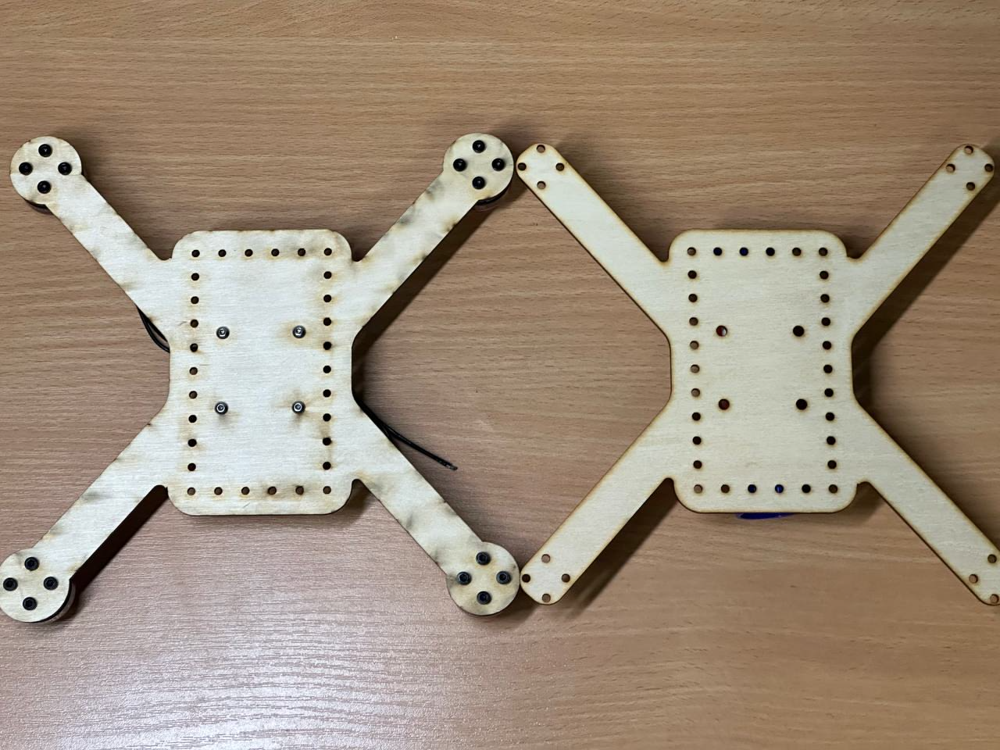
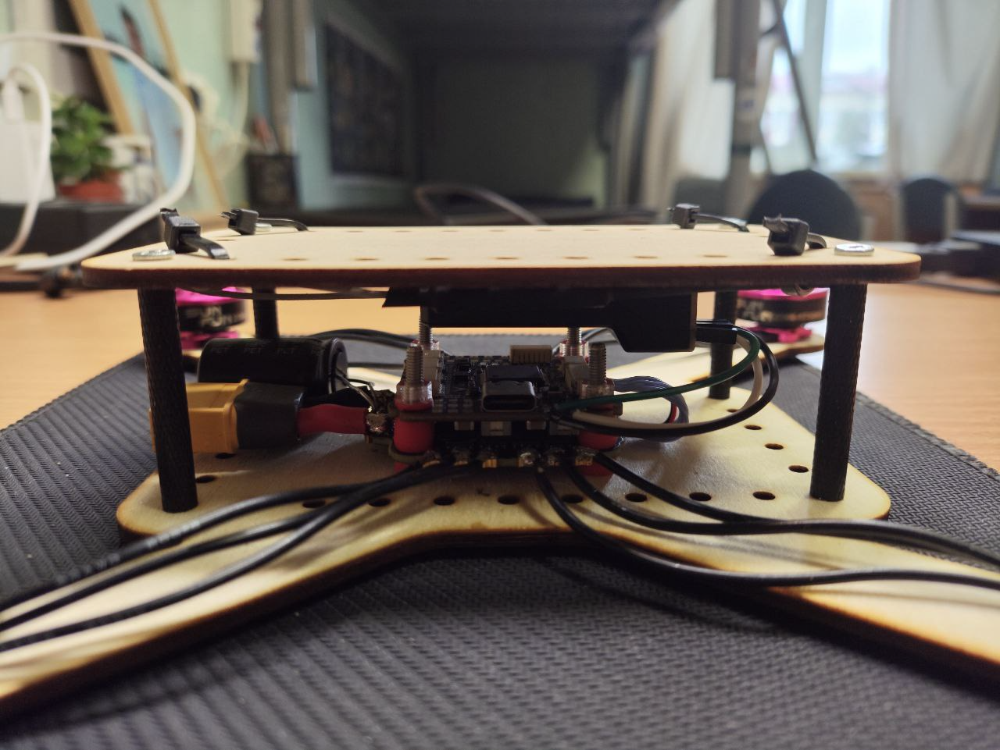

# Как собрать квадракоптер?
```
Результат - модель дрона, способная на контролируемый управляемый полет с помощью радиопультаб, готовая к расширению функционала.
```

## Разобъем создание на модели на несколько этапов:

- [Компоненты](#компоненты)
- [Создание корпуса](#корпус)
- [Пайка](#пайка)
- [Настройка полетного контроллера](#контроллер)
- [Заключение](#заключение)

<a id="компоненты"></a>
### Компоненты:
* Полетный контроллер/Плата распределениия питания (F405-v2)
* Радиоприемник/Пульт управления (FS-iA6B/SKYFLY FS-i6)
* Силовой кабель
* Моторы
* Пропеллеры

<a id="корпус"></a>
### Корпус:

Конструкция корпуса остается лишь за фантазией авторов. \
На рисунке представлены несколько вариантов, разработанных для нашей модели:



<a id="пайка"></a>
### Пайка:
На этом этапе все спаивается воедино на самом корпусе.  \
Как вышло у нас:


> **Важно:** не забыть установить конденсатор параллельно аккумулятору

<a id="контроллер"></a>
### Настройка полетного контроллера:

На данном этапе у нас возникло много проблем.
Здесь будут перечислены наши ошибки и как мы их решили. \
Видео как его настраивать:
[Как настроить полетный контроллер?](https://youtu.be/yJxMRLE3dVI?si=xul71UtIsrxmLJiV)

Для настройки полетного контроллера мы использовали [BetaFlight](https://github.com/betaflight/betaflight-configurator/releases) версии 10.10.

В процессе настройки возникли следующие проблемы: 
1.  При подключении полетного контроллера (FC - flight controller) к компьютеру он оказывался в режиме DFU - Device Firmware Update - Режим обновления прошивки - это не позволяло проводить настройку полетного контроллера вплоть до принудительного выхода из DFU режима, однако данное поведение наблюдалось при каждом подключении. Перепрошивка FC также не помогла решить эту проблему. После длительного поиска решения этой проблемы на просторах Интернета было принято решение последовать совету физического удаления кнопки boot на полетном контроллере, которая переводит его в режим прошивки. Данное решение устранило возникшую проблему, однако почему оно сработало, остается неизвестным.  
2. При настройке радиоприемника, подключенного по протоколу IBUS, не наблюдалась работа радиоаппаратуры, хотя была связь между аппаратурой и приемником. Данная проблема было решена перепрошивкой FC с предварительным выбором протокола IBUS.
3. После проведения оставшихся настроек дрон был готов к армингу (arming - запуск) без подключения FC к компьютеру. Однако ожидаемого поведения - запуска моторов - не наблюдалось. Именно на этом этапе была решена первая проблема, но на данную это не повлияло. Ошибка оказалась логической: не был выставлен параметр RX_LOST в настройках протокола регуляторов оборотов, который указывает на потерю связи с приёмником, что обычно приводит к активации режима Failsafe. 
Также была проведена настройка регуляторов оборотов с помощью веб-обеспечения ESC Configurator - была изменена прошивка и звуковой сигнал при подключении АКБ. 


[Перейти к заключению](#заключение)

## Заключение

Итоги нашего обсуждения.